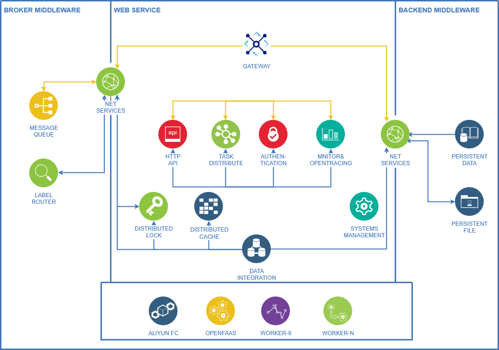
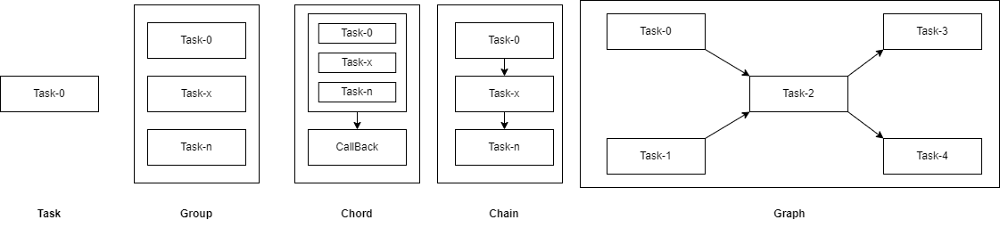
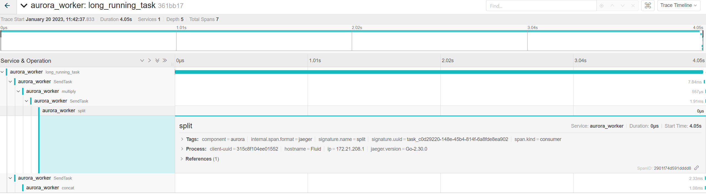

This README is just a fast quick start document. You can find more detailed documentation at Aurora.

## Why is Aurora?
任务队列是异步处理的，因为它们往往不是由一个处理请求组成，或因它们是长时间运行的任务和非即时任务，单靠使用同步处理反而降低整体响应的性能。例如：登录请求发出后，系统需要为其推送消息通知，订阅更新信息，同步处理的失败会阻碍登录的成功；另一个例子是在请求期间，像数据库查询，数据加工等等花费，延长了请求-响应周期。相反，查询可以在后台异步执行，降低整体风险。当然，还有一种解决方案，当一个进来的请求需要这些处理，查询将获取预先计算的结果，而不是重新执行更长的查询。但这种缓存机制过于死板，不适合应对动态任务请求，因此就有了开发异步任务队列的需求！
任务队列的其他类型的任务包括但不限于如下：
1. 数据同步:包括业务服务之间的业务数据和日志信息同步等等；
2. 异步处理:包括发送IM消息、异步日志、异步短信/邮件或注册/开启任务；
3. 信息收集:主要用于统计、监控、搜索、爬虫、抢票等等；
4. 服务解耦:主要用于重构和新设计时，对频繁变动的接口服务进行解耦；
5. 分布式事务消息:尤其是对数据—致性有要求的异步处理场景；
6. 削峰:秒杀、分流、限流。
   
### 未来计划

- [x] 链路追踪
- [x] 日志记录
- [x] 健康检查
- [x] 系统解耦
- [x] 独立配置
- [x] 前端管理
- [ ] 动态句柄，支持所有常见编程语言
- [ ] Prometheus监控支持
   
[体验地址]()
### 架构模式

任务队列由以下模块组成：
1. Web：负责请求的准入，校验，授权；[前端项目](https://github.com/fy403/aurora_frontend)
2. 代理Broker：负责消息的存储，传递；
3. 后台Backend：负责持久化存储整个系统的元数据和任务；
4. Worker：负责存储和调用函数句柄处理任务。
### 关键词
* `Worker`：负责实现任务消费，处理任务，并更新状态到数据库；
* `Handler`：具体的任务处理模型，在model目录中定义；
* `Web`：所有请求的API接口在此处定义。
### 核心部分
**图任务**

Aurora模型基础架构基于[RichardKnop/machinery](https://github.com/RichardKnopmachinery); 在此基础上，抽象出图任务模型，该模型的普适性更强，更能代表workeFlow的设计模式。举例来说：图模型是一系列任务的前驱-后继关系组合的任务集合，通过使用拓扑排序得到一个有序序列，并依照有序序列依次执行任务。

## Building Aurora
```shell
# 方式一：自行编译
go build . -o aurora
# 方式二：全局安装
go install .
```
## Running Aurora
```shell
# 运行Web实例
aurora web --config=./config/config.toml
# 运行worker实例
aurora worker --config=./config/config.toml
```
## Playing with Aurora
由于aurora依赖于mongoDB，以及RabbitMQ；因此，请确保提前运行依赖并在配置文件中显式给出。
启动完web以及worker后，即可在提示的前端中配置图任务流程。
## Source code layout
```txt
├───client # 专属客户端实例
│   └───go # golang的客户端脚本
├───cmd    # 使用github.com/spf13/cobra定义的cmd命令实例
├───config # 启动配置文件模板
├───draw   # 架构指南
├───images
└───internal        # 内部所有代码
    ├───api         # wb前端部署，以及api接口定义
    ├───app         # 暂未使用
    ├───auth        # 授权模块
    ├───backends    # 后端数据存储
    ├───brokers     # 消息队列
    ├───center      # 一个请求实例，请求broker和backend
    ├───common      # 通用基础类
    ├───config      # 配置实例定义
    ├───locks       # 分布式锁
    ├───model       # 所有句柄模型
    ├───opentracing # 链路追踪
    ├───request     # 请求实例定义
    ├───retry       # 重试模块
    ├───tasks       # 任务处理反射模型
    ├───web         # 前端编译入口
    └───worker      # 任务处理模型
````
### 链式追踪,精准定位
由于架构的设计方式，使得分布式定位问题变得困难；依次引入了opentracing追踪模块，记录每一次任务处理过程和细节。
